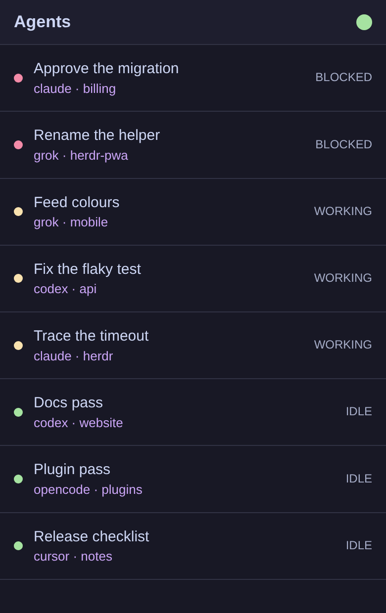
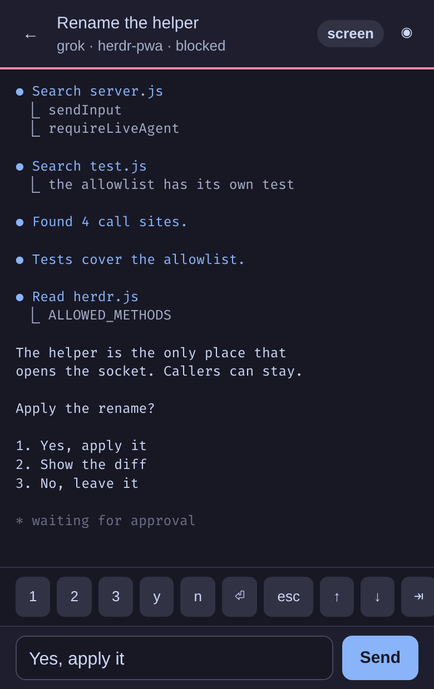

# herdr-pwa

Answer a [Herdr](https://github.com/herdrdev/herdr) agent from your phone.

Herdr is the runtime your coding agents live on. This runs beside it, on the same machine, and puts that session on a handset: which agents are up, what each one is showing, and a way to reply. The approval that has a run stopped is the case it exists for.

The phone reaches it over Tailscale. On iPhone, Add to Home Screen opens it without the browser chrome.

[Run it](#run-it-on-a-phone) · [Features](#features) · [Develop](#develop) · [Releases](#releases)

<p align="center">
  
  
</p>

It runs against the Herdr on your machine, so the pictures are a sample session. Blocked agents sort to the top. Open one, and the prompt, the keys it is waiting on, and the reply box are on a single screen.

## Features

- **Stuck agents come first.** The list sorts blocked, then working, then idle. A row shows the workspace name, which agent it is, the directory, and a status dot in Herdr's colours.
- **The feed, on a phone.** Recent scrollback by default. The screen control swaps that for the visible pane. Horizontal rules are dropped. Lines take their colour from the glyphs agents print, in whatever theme Herdr is using, light palettes included.
- **Reply, including an approval.** The composer sends text. When the agent is blocked, that text goes in as pane input, which is how a prompt accepts an answer.
- **The key the prompt expects.** `1` `2` `3`, `y` `n`, enter, esc, the arrows, tab, shift-tab, and ctrl-c.
- **Bring it forward on the desktop.** The circle in the header focuses that agent in Herdr on the host.
- **A light for the socket.** Green after a list poll reaches Herdr, red when it does not. The shell still opens if the phone loses Tailscale. Live status is never served from cache.
- **Home screen app.** Safari, Share, Add to Home Screen. It then launches standalone.

## How a tap gets there

The phone talks to Tailscale Serve. Serve adds your Tailscale login and proxies to the adapter on `127.0.0.1:8787`. The adapter checks that login, then opens one connection per call to `~/.config/herdr/herdr.sock`. The host port is loopback, so the LAN never sees the adapter.

## Run it on a phone

You need:

- Herdr running on this machine, socket at `~/.config/herdr/herdr.sock`
- [mise](https://mise.jdx.dev), then `mise install` once in this directory for Node 26
- Docker, for the image that `mise phone` runs
- Tailscale, logged in as the same identity you put in `ALLOWED_LOGIN`

### Configure

```sh
cp .env.example .env
```

Set `ALLOWED_LOGIN` to your Tailscale login, the value Serve puts in `Tailscale-User-Login`. `HERDR_UID` and `HERDR_GID` default to 1000. If your user is not uid 1000, set them to `id -u` and `id -g`. The container has to match the owner of Herdr's `0600` socket.

`.env` is gitignored.

### Start

```sh
mise phone
```

That pulls the released image, starts compose on `127.0.0.1:8787`, and runs `tailscale serve --bg 8787`. It prints this node's MagicDNS URL.

On the iPhone, with Tailscale connected:

1. Open the printed URL in **Safari**. On iOS, Add to Home Screen lives there. The URL looks like `https://<machine>.<tailnet>.ts.net`.
2. Confirm the agent list loads and the colours match Herdr.
3. Share → Add to Home Screen, then launch from the icon. It opens without Safari chrome.
4. Open a feed, send a reply, and confirm it lands in Herdr on the host.
5. Get an agent to an approval prompt and answer it from the phone.
6. Turn Tailscale off and relaunch. The app shell opens with an error.

HTTPS comes from Tailscale's MagicDNS certificate. If Safari warns about it, enable HTTPS certificates for the tailnet and retry.

`mise smoke` against compose sends `Tailscale-User-Login` from `ALLOWED_LOGIN` in `.env`.

### Stop

```sh
mise down
mise serve:off
```

`mise logs` follows compose. `mise status` shows compose and Tailscale Serve.

## Develop

```sh
mise test     # node --test
mise dev      # 127.0.0.1:8787 with DEV_BYPASS_AUTH=1
mise smoke    # GET /api/agents
```

`mise dev` skips the Tailscale identity check so you can open the adapter from the host. `compose.yaml` leaves that check on.

Open `http://127.0.0.1:8787/` in a desktop browser. `mise dev` and `mise up` both bind 8787, so run one of them.

## Releases

Versions are `0.x` and come from [conventional commits](https://www.conventionalcommits.org). `fix:` is a patch, `feat:` is a minor, and while the project is pre-1.0 a breaking change (`feat!:` or a `BREAKING CHANGE:` footer) is also a minor. Reaching `1.0.0` is a deliberate decision.

Pull requests are squash-merged, so the pull request title becomes the commit message, and it has to be a conventional commit. CI rejects titles that are not.

### Running a release

`mise up` pulls the newest release. To pin or roll back, set the version in `.env` and run it again:

```sh
HERDR_PWA_VERSION=0.1.0
```

Images are at `ghcr.io/ibarsi/herdr-pwa`. A release is ready to run once that package page lists the tag. The git tag is created first, and the image build can still fail after it.

### Cutting a release

Merging to `main` cuts the release when the new commits include a `feat`, a `fix`, or a breaking change. The workflow writes `CHANGELOG.md` from those commits, tags, and pushes with the release deploy key. That tag push builds the image and opens the GitHub Release. A `docs` or `chore` merge publishes nothing. Follow the build with `gh run watch`.

`mise release:preview` prints what the next merge would cut. Commits the parser rejects are listed in a warning and left out of the changelog.

## Security

Auth is the `Tailscale-User-Login` header. Only the login in `ALLOWED_LOGIN` is accepted. Tailscale does not set that header on tagged devices, so those devices are refused. A shared tailnet is not a trusted perimeter.

The adapter emits six Herdr methods: `agent.list`, `workspace.list`, `agent.read`, `agent.prompt`, `pane.send_input`, and `agent.focus`. `pane.split`, `layout.apply`, and `plugin.action.invoke` are not among them. Each of those takes argv, and proxying them would make this a remote code execution endpoint.

The host publish is loopback (`127.0.0.1:8787`). Inside the container, `BIND_HOST=0.0.0.0` so docker-proxy can reach the process. The socket is mounted as a directory, so a Herdr restart is picked up with the new inode. If 503s continue after a restart, `docker compose restart`.

## Themes

Themes are extracted from Herdr's source. After a Herdr upgrade:

```sh
node tools/extract-themes.js /path/to/herdr-checkout > themes.json
```
